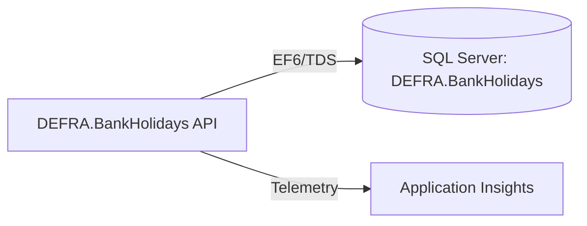

# Assessment - DEFRA.BankHolidays

## Identification

**Repository Name**: bank-holidays (solution: `DEFRA.BankHolidays`)
**Type**: API (ASP.NET Web API 2, hosted in IIS)
**Language**: C#
**Frameworks**: .NET Framework 4.5.2, ASP.NET MVC/Web API 5.2.3, Entity Framework 6.1.3
**Repository URL**: Local clone only — `bank-holidays/` (no `codebase-repos.md` supplied; git remote unavailable in this workspace)

## Summary
DEFRA.BankHolidays is a small, self-contained ASP.NET Web API 2 service that exposes UK bank holiday data to other applications in the DEFRA/RPA estate. It is one of the simplest applications in the portfolio — a single `HolidayContext` Entity Framework 6 data access layer with a thin `ValuesController` Web API surface, plus a boilerplate `HomeController` for the default MVC scaffold page.

The service uses on-box SQL Server (via Windows Integrated Security) as its only dependency, has an obfuscation report (`obfuscation-report.html`) suggesting the build pipeline runs a .NET obfuscator before deployment, and instruments itself with Application Insights (classic SDK, key configured out-of-band).

## Service Dependencies

### Cloud Services (GCP/AWS/Azure)
- **Application Insights (classic SDK 2.2.0)**: Telemetry/APM — instrumentation key not present in source (externally configured)

### Databases
- **DEFRA.BankHolidays (SQL Server, `HolidayContext`)**: Local/on-prem SQL Server instance (`Data Source=.`), Windows Integrated Security, EF6 Code-First/DB-First context — stores bank holiday reference data

### Messaging
- None found

### Storage
- None found

### APIs and External Integrations
- None found (this service is itself consumed by other apps, not a consumer)

### Other Dependencies
- ASP.NET Web API 5.2.3 / MVC 5.2.3 / Web Optimization (bundling) — legacy web stack
- `Microsoft.CodeDom.Providers.DotNetCompilerPlatform` — Roslyn compiler support for legacy `.csproj`

## Communication

### Exposed Endpoints
| Method | Path | Description | Authentication |
|--------|------|--------------|-----------------|
| GET/POST/etc. | `/api/values` (`ValuesController`) | Default Web API scaffold controller — likely superseded by real holiday endpoints not yet renamed/found | None visible in code |
| GET | `/` (`HomeController`) | Default MVC index page | None |

### Consumed Endpoints
- None found

### Asynchronous Communication
- None found

### Communication Diagram

## Configuration

### Environment Variables
- None — configuration is via `Web.config` (transformed per environment: Debug/Release/SIT/UAT/Production)

### Configuration Files
- `Web.config` (+ `Web.{Debug,Release,SIT,UAT,Production}.config` transforms): connection strings, AppInsights module registration
- `packages.config`: legacy NuGet package pinning

### Secrets and Sensitive Parameters
- SQL connection uses Windows Integrated Security (no stored credentials in code)
- Application Insights instrumentation key not present in repo (managed externally / per-environment config transform)

## Infrastructure

### Containerization
- **Dockerfile**: No
- **Base Image**: N/A
- **Exposed Ports**: N/A (IIS-hosted)

### Kubernetes/Helm
- **Manifests**: No
- **Helm Charts**: No

### Infrastructure as Code
- **Terraform**: No
- **CloudFormation/Bicep**: No

### CI/CD
- **Pipeline**: None found in the repository itself (only the generic scaffolded `.github/workflows/{ci,pptx-generate,release-please,release-vscode-extension}.yml` injected by the migration tooling — not an application build/deploy pipeline)
- **Files**: N/A
- **Stages**: N/A
- **Note**: `obfuscation-report.html` implies an external/manual build step performs binary obfuscation prior to release; this is not automated in-repo

### Legacy Deployment Artifacts
- IIS Web Deploy style `Web.{env}.config` transforms present, implying manual/MSDeploy-based release to on-prem IIS

## Testing

### Coverage
- **Percentage**: Not measured/available
- **Tool**: NUnit3TestAdapter, Moq, EntityFrameworkTesting.Moq (per `DEFRA.BankHolidays.Tests/packages.config`)

### Test Types
- **Unit**: Yes — `DEFRA.BankHolidays.Tests` project (NUnit + Moq + EF6 in-memory-style testing helpers)
- **Integration**: Not evident
- **E2E**: Not evident

### Observations
Test project exists and pulls in reasonable mocking tooling for EF6, but actual coverage could not be quantified without running the test suite.

## Points of Attention for Multi-Cloud/Azure Migration

### Cloud-Specific Dependencies
- None (pure on-prem SQL Server + IIS) — this is a "clean" candidate; no vendor lock-in beyond Windows/IIS/SQL Server assumptions

### Hardcoded Configurations
- `Data Source=.` (local SQL Server instance) hardcoded in base `Web.config`, overridden per environment via config transforms — needs migrating to `appsettings.json`/Key Vault-backed connection string once modernized

### Legacy Code or Old Patterns
- .NET Framework 4.5.2 (out of support) — must upgrade to .NET 8/10 LTS as part of any Azure App Service/Container Apps target
- ASP.NET Web API 2 / OWIN-less legacy hosting model — needs rewrite to ASP.NET Core minimal APIs or controllers
- EF6 → EF Core migration required
- Classic Application Insights SDK (`Microsoft.ApplicationInsights.Web`) → replace with `Microsoft.ApplicationInsights.AspNetCore` or OpenTelemetry
- ASP.NET Membership/Role provider not used here (unlike other repos in the estate) — simplest auth footprint in the portfolio

### Specific Recommendations
1. Treat as a low-complexity "quick win" modernization candidate — small surface area, single DB dependency, no shared internal library (`IDT.dll`) dependency found.
2. Rebuild on .NET 8/10 LTS + ASP.NET Core Minimal API, targeting Azure App Service.
3. Migrate `HolidayContext` from EF6 to EF Core against Azure SQL Database (or Azure SQL Managed Instance if lift-and-shift of schema is preferred).
4. Replace classic Application Insights SDK with the ASP.NET Core / OpenTelemetry-based SDK.
5. Confirm the real `ValuesController`/bank-holiday endpoints exist beyond the scaffold controllers found — recommend a controller-by-controller review before code generation in Phase 2.

## Additional Observations
- `README.md` is the unmodified Azure DevOps project template (no real documentation) — purpose was inferred entirely from code/config.
- No evidence of the shared `IDT.dll` internal security library used by the other RPA/CPH/MTS/QualityPortal apps — this app does not appear to share the "Security" or "People" SQL Server databases used elsewhere in the estate.
